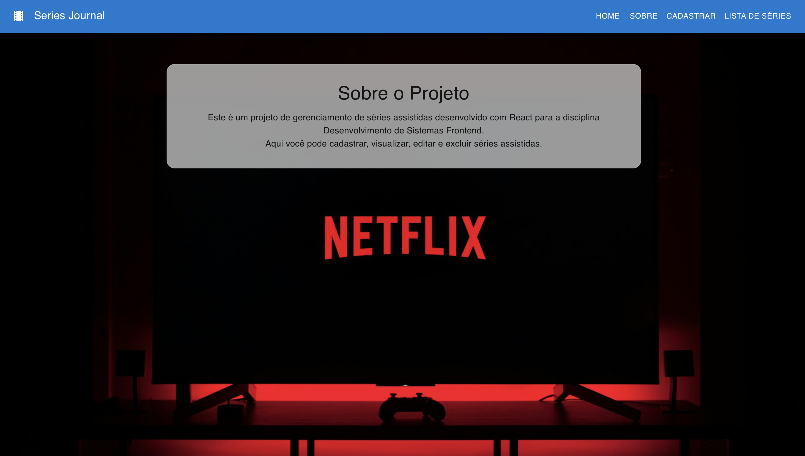
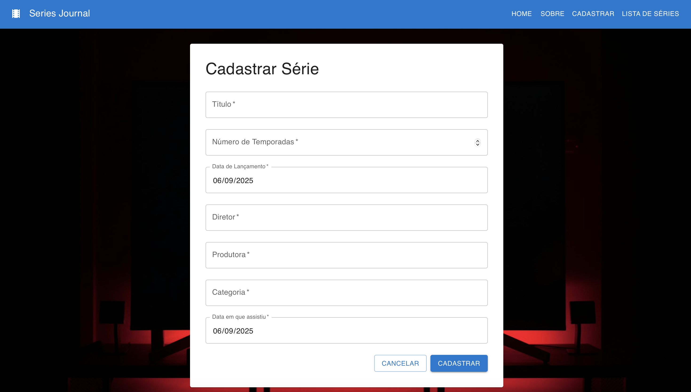
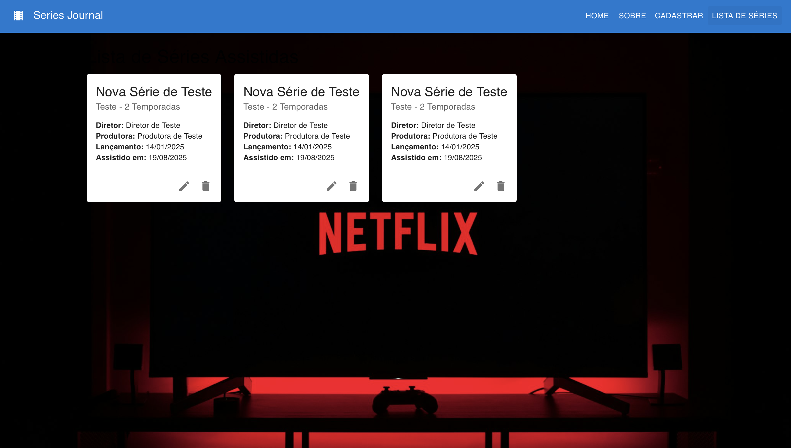

# Nome: Alexandre Sousa Dias Junior

## Como Executar o Projeto Series Journal - Fase 2

### Pré-requisitos

Antes de começar, garanta que você tenha os seguintes softwares instalados na sua máquina:

- Node.js (versão LTS recomendada)
- Git
- Um editor de código como o VS Code

### Instalação e Execução

O projeto é dividido em duas partes: o Backend (API) e o Frontend (React). Ambas precisam estar rodando simultaneamente.

1. **Configurando o Backend (API)**

A API fornecida no repositório da disciplina(DesenvolvimentoFrontend) é um template genérico para "livros" (books). Precisamos ajustá-la para funcionar com "séries" (series).

*Clone o repositório da disciplina*
git clone https://github.com/adsPucrsOnline/DesenvolvimentoFrontend.git

### Ajustes Manuais Obrigatórios na API

Navegue até a pasta DesenvolvimentoFrontend/readingJournal-api e realize as seguintes alterações:

a) Crie o arquivo de dados series.json:

1. Dentro da pasta data/, crie um novo arquivo chamado series.json.
2. Coloque o seguinte conteúdo nele para iniciar com uma lista vazia:

    ```bash
    []
    ```

b) Crie o arquivo de rotas series.js:

1. Dentro da pasta routes/, da pasta readingJournal-api coloque o arquivo series.js que está na raiz do projeto series-journal.

c) Registre a nova rota no app.js:

1. Abra o arquivo app.js na raiz da API.
2. Adicione as duas linhas destacadas abaixo para que o Express reconheça suas novas rotas:

// var seriesRouter = require('./routes/series'); // <-- ADICIONE ESTA LINHA
// app.use('/series', seriesRouter); // <-- ADICIONE ESTA LINHA

### Iniciando a API

Com os ajustes feitos, abra um terminal na pasta readingJournal-api e execute:

1. Instala as dependências da API
    ```bash
    npm install
    ```

2. Inicia o servidor da API
    ```bash
    npm start
    ```

A API estará em execução em http://localhost:5000 (ou 5001, confirme a porta no arquivo /bin/www). Mantenha este terminal rodando.

2. Configurando o Frontend (React App)

Abra um novo terminal.
Navegue até a pasta do seu projeto series-journal.
Instale as dependências:
    ```bash
    npm install
    ```
Inicie a aplicação:
    ```bash
    npm start
    ```
A aplicação será aberta no seu navegador em http://localhost:3000.

## Como Executar os Testes

### Testes Unitários (Jest)
Os testes unitários verificam componentes individuais de forma isolada.

No diretório do frontend (series-journal)

    ```bash
    npm test
    ```

### Testes End-to-End (Cypress)

Os testes E2E simulam um fluxo completo do usuário. É necessário que a API e o Frontend estejam rodando para executá-los.

No diretório do frontend, em um novo terminal

    ```
    npx cypress open
    ```
Na interface do Cypress, selecione "E2E Testing", escolha um navegador e clique no arquivo series.cy.js para rodar o teste.

## Introdução

Este projeto é a implementação de um sistema frontend para a disciplina de Desenvolvimento de Sistemas Frontend do Curso Superior de Tecnologia em Análise e Desenvolvimento de Sistemas da PUCRS.

O Series Journal é uma aplicação web do tipo SPA (Single Page Application) que permite ao usuário gerenciar um diário de séries assistidas. A aplicação consome uma API REST para realizar operações de CRUD (Create, Read, Update, Delete) de forma dinâmica.

Tecnologias Utilizadas: React, React Router, Axios, Material-UI, Jest, Cypress e Node.js (para a API).

## Descrição dos Componentes

O projeto foi estruturado utilizando uma arquitetura baseada em componentes para promover a reutilização e a organização do código.

-   **`App.jsx`**: omponente raiz que configura o react-router-dom para gerenciar as rotas da aplicação.
-   **`NavBar.jsx`**: Barra de navegação superior, contendo os links para as diferentes páginas da aplicação.
-   **`SerieForm.jsx`**: CFormulário dinâmico para criar e editar séries. Ele busca os dados da série na API quando está em modo de edição.
-   **`SerieList.jsx`**: Componente que busca e exibe a lista de todas as séries da API em formato de cards. Contém as ações de editar e excluir.
-   **`Componentes de Página (HomePage.jsx, AboutPage.jsx, etc.}`**: Componentes que estruturam o conteúdo de cada rota específica.
-   **`api.js`**: Módulo de serviço que centraliza a configuração do axios para se comunicar com o backend.

## Funcionalidades Implementadas

1. Roteamento Dinâmico: Navegação fluida entre as páginas sem recarregamento, utilizando react-router-dom.

2. CRUD Completo:
    1. Criação (Create): Adicionar novas séries à coleção através de um formulário.
    2. Leitura (Read): Listar todas as séries cadastradas, buscando os dados da API.
    3. Atualização (Update): Editar as informações de uma série existente.
    4. Exclusão (Delete): Remover uma série da coleção.

3. Interface Moderna: Componentes estilizados com a biblioteca Material-UI, com um tema customizado de "glassmorphism" para um visual moderno.
4. Testes: Cobertura de testes unitários com Jest e testes de ponta a ponta (E2E) com Cypress para garantir a qualidade e o funcionamento dos fluxos principais.

## Demonstração

Abaixo estão as telas da aplicação implementada:

**Página Inicial**


**Página Sobre**



**Página de Cadastro de Séries**



**Página de Listagem de Séries**



## Decisões de Desenvolvimento

Esta seção documenta as principais escolhas de arquitetura e tecnologia feitas durante a construção do projeto.

### Gerenciamento de Estado e Fluxo de Dados:

Na Fase 1, o estado foi centralizado no componente App.jsx (padrão "lifting state up"), que continha a lista estática de séries e a passava para os componentes filhos via props.

Na Fase 2, a responsabilidade pelo estado dos dados foi transferida para os componentes que os consomem (como o SerieList), que agora buscam as informações diretamente da API utilizando o hook useEffect.

### Comunicação com o Backend:

A biblioteca axios foi escolhida para realizar as requisições HTTP à API REST.

Foi criado um módulo de serviço (src/services/api.js) para centralizar a configuração do axios com a baseURL da API, facilitando futuras manutenções.

### Roteamento: 

Para criar uma experiência de Single Page Application (SPA) real, com URLs únicas para cada página, foi implementada a biblioteca react-router-dom . Os componentes <BrowserRouter>, <Routes> e <Route> foram utilizados no App.jsx para definir a estrutura de navegação .

### UI e Estilização: 

Foi adotada a biblioteca de componentes Material-UI pela sua robustez, acessibilidade e grande variedade de componentes prontos. Para atender à preferência de um design "Liquid Glass", foi aplicada uma estilização customizada com CSS (backdrop-filter) para criar um efeito de glassmorphism nos cards e formulários, combinando a funcionalidade da biblioteca com a estética desejada.

### Formulários: 

Os formulários foram implementados como componentes controlados, onde o valor de cada campo é vinculado a uma variável de estado gerenciada pelo hook useState. Isso garante que o React seja a "fonte da verdade" para os dados do formulário.

### Testes: 

Adotou-se uma estratégia de testes em duas camadas para garantir a qualidade do software:

1. Testes Unitários: Utilizando Jest e React Testing Library, foram criados testes para validar a renderização e o conteúdo de componentes isolados.

2. Testes End-to-End (E2E): Utilizando o Cypress, foi criado um teste para simular o fluxo completo de cadastro de um usuário, garantindo a correta integração entre o formulário, a navegação e a comunicação com a API