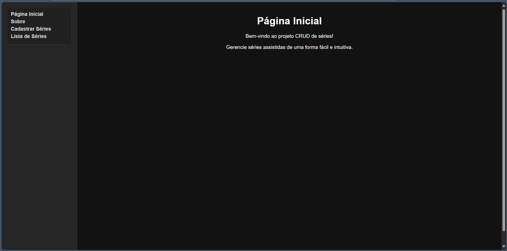
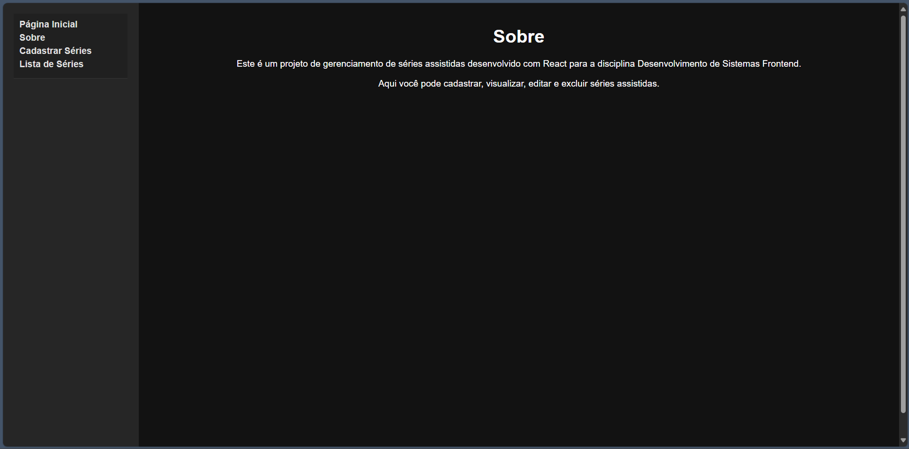
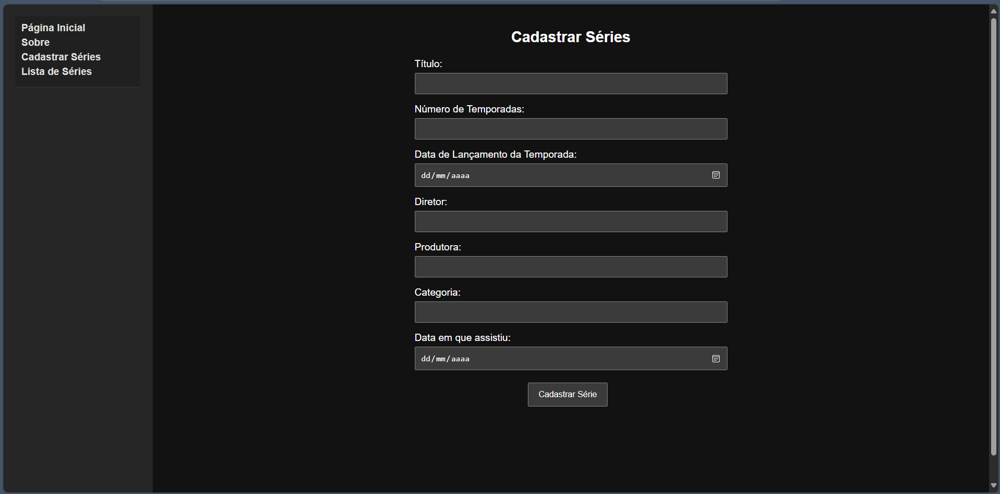
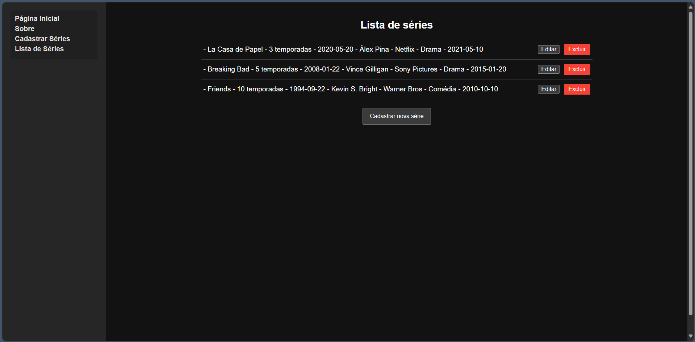

# Nome: Alexandre Sousa Dias Junior

## Como Executar o Projeto Series Journal - Fase 1

Para executar o projeto localmente, siga os passos abaixo:

1.  **Entre pasta usando o terminal:**
    ```bash
    cd series-journal
    ```

2.  **Instalar as dependências:**
    No diretório do projeto, execute o comando para instalar todos os pacotes necessários.
    ```bash
    npm install
    ```

3.  **Iniciar a aplicação:**
    Após a instalação, inicie o servidor de desenvolvimento.
    ```bash
    npm start
    ```
    A aplicação estará disponível em `http://localhost:3000` no seu navegador.

## Introdução

Este projeto é a primeira fase do desenvolvimento de um sistema frontend para a disciplina de Desenvolvimento de Sistemas Frontend do Curso Superior de Tecnologia em Análise e Desenvolvimento de Sistemas da PUCRS.

O objetivo é implementar um CRUD (Create, Read, Update, Delete) estático para um repositório de séries assistidas (Series Journal) utilizando React.

## Descrição dos Componentes

O projeto foi estruturado utilizando uma arquitetura baseada em componentes para promover a reutilização e a organização do código.

-   **`App.jsx`**: Componente principal que atua como o "container" da aplicação. Ele gerencia o estado da lista de séries e controla qual página é exibida para o usuário.
-   **`NavBar.jsx`**: Componente de navegação. Exibe os links para as diferentes seções da aplicação (Página Inicial, Sobre, Cadastrar, Listar) e comunica a seleção do usuário ao componente `App`.
-   **`SerieForm.jsx`**: Componente que contém o formulário para adição e edição de séries. É um componente controlado, gerenciando os dados de entrada através do seu estado interno e validando as informações antes de submetê-las.
-   **`SerieList.jsx`**: Componente responsável por receber a lista de séries (via props) e renderizá-la para o usuário. Para cada item, exibe os dados da série e os botões de ação (Editar e Excluir).

## Funcionalidades Implementadas

Nesta primeira fase, todas as funcionalidades de CRUD são estáticas, ou seja, os dados são manipulados em memória através do estado do React e não são persistidos.

-   **Listagem de Séries:** A tela principal exibe uma lista com todas as séries cadastradas.
-   **Cadastro de Séries:** Um formulário permite adicionar uma nova série à lista.
-   **Edição de Séries:** É possível selecionar uma série existente e editar suas informações no mesmo formulário de cadastro.
-   **Exclusão de Séries:** Cada série na lista pode ser removida.
-   **Validação de Formulário:** Validação básica para garantir que todos os campos sejam preenchidos antes do cadastro.

## Demonstração

Abaixo estão as telas da aplicação implementada:

**Página Inicial**


**Página Sobre**


**Página de Cadastro de Séries**


**Página de Listagem de Séries**


## Decisões de Desenvolvimento

-   **Gerenciamento de Estado:** O estado principal da aplicação (a lista de séries) foi centralizado no componente `App.jsx` (padrão "lifting state up"). Isso simplifica o fluxo de dados, pois o `App` se torna a única fonte da verdade e distribui os dados e as funções de manipulação para os componentes filhos via `props`.
-   **Navegação:** A navegação entre as "páginas" foi implementada de forma estática, utilizando o estado do `App.jsx` e renderização condicional, sem a necessidade de uma biblioteca de roteamento externa nesta fase.
-   **Imutabilidade:** Todas as operações de manipulação do estado (adicionar, editar, excluir) foram feitas de forma imutável, criando novos arrays com os dados atualizados (`spread syntax`, `.map()`, `.filter()`) em vez de modificar o array original. Esta é uma prática fundamental do React para garantir a previsibilidade e o correto funcionamento das renderizações.
-   
# Series Journal - Fase 2

Este projeto é a segunda fase do sistema frontend para a disciplina de Desenvolvimento de Sistemas Frontend. Nesta etapa, a aplicação estática foi transformada em uma Single Page Application (SPA) dinâmica, que consome uma API REST para realizar operações de CRUD.

A interface foi modernizada com o uso da biblioteca Material-UI, com um estilo customizado para simular o efeito "glassmorphism".

## Como Executar o Projeto

Para executar o projeto completo, tanto a API de backend quanto a aplicação de frontend precisam estar rodando simultaneamente.

### 1. Executando a API (Backend)

**Pré-requisitos:** Node.js e npm instalados.

```bash
# Clone o repositório oficial da disciplina
git clone [https://github.com/adsPucrsOnline/DesenvolvimentoFrontend.git](https://github.com/adsPucrsOnline/DesenvolvimentoFrontend.git)

# Navegue até a pasta da API
cd ./DesenvolvimentoFrontend/readingJournal-api/

# Instale as dependências
npm install

# Inicie o servidor da API
npm start